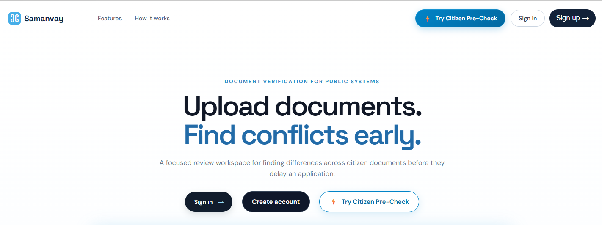
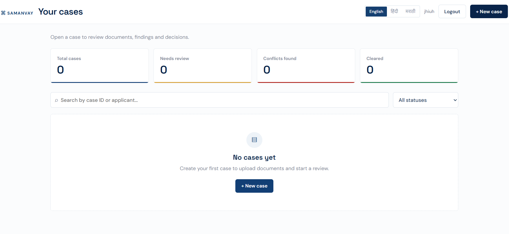
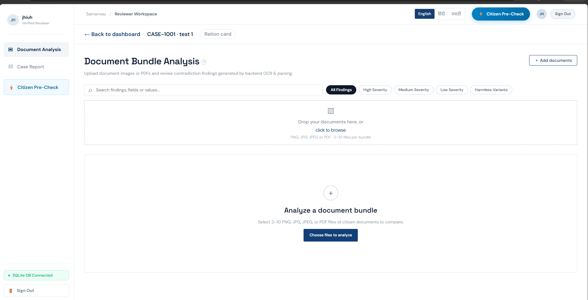
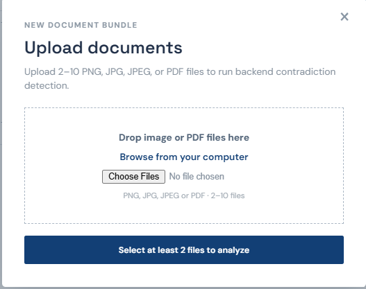
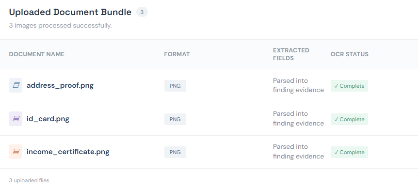
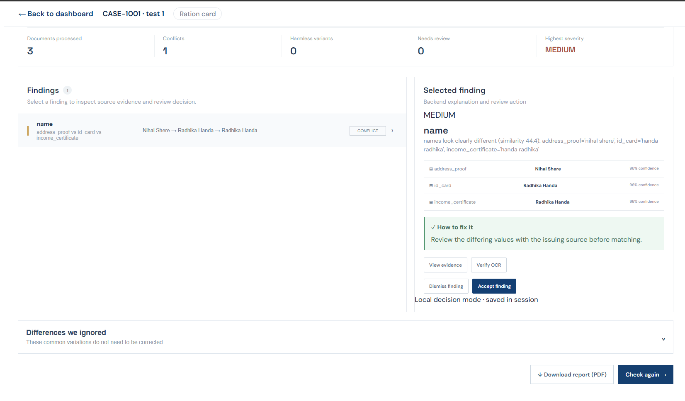

# AI Document Contradiction Detector

This repository contains a Vite/React frontend and a FastAPI backend for analysing a bundle of citizen-submitted documents (PNG, JPG, JPEG images and PDF files). The backend uses OCR, extraction, conservative normalization, and field-specific comparison rules to flag contradictions while retaining raw values, confidence, and source bounding boxes.

All repository documents are synthetic specimens. Do not add real identities or production documents. Ground-truth labels are evaluation-only and are never read during normal analysis.

## Run the backend

The easiest way on Windows is the bundled script. It creates `.venv` if it is missing, installs `backend/requirements.txt`, puts Tesseract on `PATH`, reads the environment from the root `.env` file, generates `YONKO_SESSION_SECRET` if missing, refuses to start if the port is already taken, and then runs uvicorn:

```powershell
.\start-backend.ps1            # add -Reload for auto-reload, -Port to change the port
```

`YONKO_SESSION_SECRET` is generated once and appended to `.env`, so reviewer sessions survive restarts. To start the server by hand instead:

```powershell
cd backend
.\.venv\Scripts\Activate.ps1
uvicorn app.main:app --reload
```

The API is available at `http://127.0.0.1:8000`:

- `GET /health`
- `GET /health/ocr`
- `GET /api/info`
- `POST /auth/signup`, `POST /auth/signin`, `POST /auth/profile`, `POST /auth/logout`
- `GET|POST /cases`, `GET /cases/{id}`, `PATCH /cases/{id}/*`, `POST /cases/{id}/analysis`
- `POST /analyze` — **requires a signed-in reviewer**

Run backend tests with:

```powershell
cd backend
$env:PATH = "C:\Program Files\Tesseract-OCR;$env:PATH"
..\.venv\Scripts\python.exe -m pytest -q --basetemp .pytest-tmp
```

## Security

The backend ships with production-grade controls; see [docs/SECURITY.md](docs/SECURITY.md)
for the full model. Highlights:

- PBKDF2 (600k iterations) password hashing, hashed+expiring session tokens
- Brute-force lockout, per-IP rate limiting, anti-enumeration sign-in
- Magic-byte upload validation, 16 MB/file cap, path-traversal-safe temp files
- Parameterised SQL everywhere, per-reviewer data isolation, audit log
- Security headers, strict CORS allow-list, non-root Docker user

Two ways to prove it (for judges):

```powershell
# 1. Automated attack suite (24 tests)
cd backend; ..\.venv\Scripts\python.exe -m pytest tests/test_security.py -v

# 2. Live attack demo against the running server
.\security-demo.ps1
```

## Deployment

### Backend on Render

`render.yaml` defines the full stack: a Docker web service plus a managed
PostgreSQL database. Deploy from the Render dashboard ("New → Blueprint")
and point it at this repository. Render will:

- build `backend/Dockerfile` (Python 3.11 + Tesseract),
- create the Postgres database and wire `DATABASE_URL` automatically,
- generate a random `YONKO_SESSION_SECRET`.

You will be asked for one value: **`CORS_ALLOW_ORIGINS`** — set it to your
Vercel URL, e.g. `https://your-app.vercel.app`.

### Frontend on Vercel

1. Import the repository in Vercel (framework preset: **Vite**).
2. Set the environment variable **`VITE_API_BASE_URL`** to your Render URL,
   e.g. `https://yonko-api.onrender.com`.
3. Deploy. `vercel.json` adds the SPA rewrite plus security headers
   (CSP, HSTS, nosniff, frame-deny).

After both are live, update `CORS_ALLOW_ORIGINS` on Render to include the
final Vercel domain.

## Run the frontend

From the repository root:

```powershell
npm install
npm run dev
```

The frontend defaults to `http://localhost:8000`. To target another backend address, create a root `.env` file:

```env
VITE_API_BASE_URL=http://localhost:8000
```

## Reviewer sign in

The reviewer portal offers **Email and password** authentication for reviewers. Accounts are saved in local storage for the demo with profile onboarding (name and date of birth).


*Landing page: reviewers sign in or create an account.*


*Case dashboard after sign in: case counts, search, and status filter.*

## Analysis request

The frontend sends a multipart `POST /analyze` request using the `files` field. Submit 2–10 non-empty PNG, JPG, or JPEG images or PDF files with unique filenames. Each PDF may contain at most 10 pages. JPEG uploads are converted to PNG and every PDF page is rasterised to a PNG image in the backend's temporary directory before OCR, so the detection engine only ever sees images.


*Reviewer workspace for a case: severity filters and the upload area.*


*Upload dialog: 2–10 PNG, JPG, JPEG, or PDF files per bundle.*

Uploads are processed in a temporary backend directory and removed after analysis. The UI therefore displays returned text evidence, confidence, bounding boxes, and warnings rather than durable image previews.


*Processed bundle: each document with its format and OCR status.*


*Findings view: per-document values with confidence, a suggested fix, and Accept or Dismiss.*

For the response contract, see [docs/API_CONTRACT.md](docs/API_CONTRACT.md). The frontend is configured to call this API directly.
